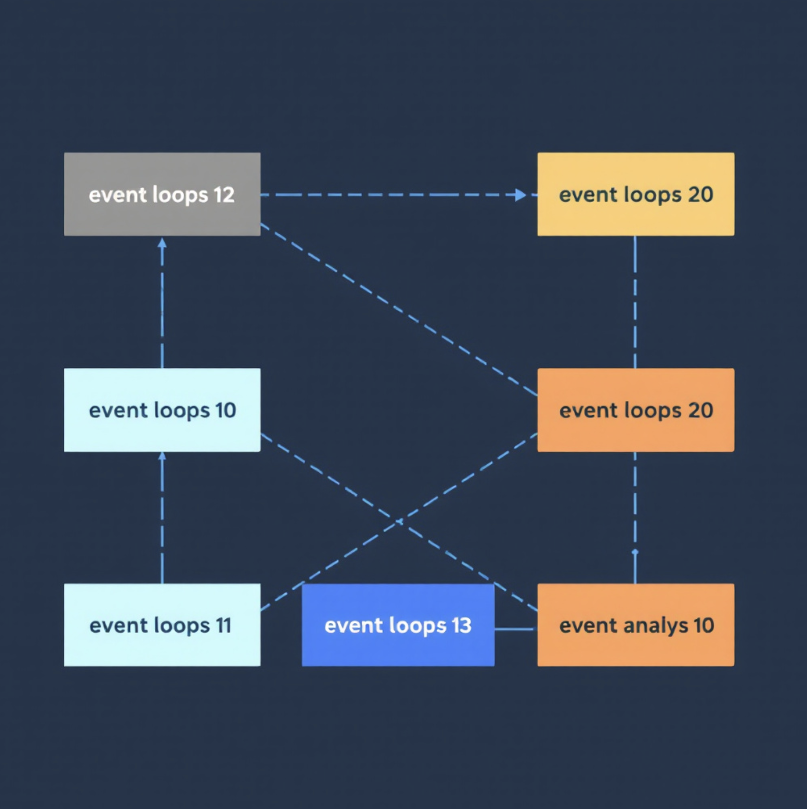

## Анализ Блокировок Цикла Событий




## Предпосылки:
В асинхронном программировании блокировка цикла событий может серьезно повлиять на производительность приложения.
Данная задача исследует влияние смешивания синхронных блокирующих операций (time.sleep) с
асинхронным кодом (asyncio.sleep) и измеряет результирующее время блокировки цикла событий.

## Описание Задачи
1. В тестах реализован сервис, который генерирует блокирующие и неблокирующие операции и непрерывно нагружает ими цикл событий (event loop).
   
2. Ваша задача:
   - Создать механизм для измерения времени блокировки цикла событий (блокировкой считается задержка более 0.001 секунды)
   - Вычислять и отображать среднюю продолжительность блокировок, медиану и максимальную длительность блокировки
   - Рассчитывать количество блокировок

Формат вывода:
```
{
    "average": 0.001,
    "median": 0.001,
    "max": 0.001,
    "num_blocking": 100
}
```

Формат класса:
```
import asyncio

class EventLoopMonitor:
    def __init__(self):
        pass
        
    async def monitor_callback(self) -> None:
        """
        Callback to measure time between event loop iterations.
        Runs asynchronously as a daemon in the event loop.
        """
        pass
            
    def get_statistics(self) -> dict:
        """
        Calculate statistics about blocking times.
        TODO: Replace with actual implementation
        """
            
        return {
            "count": 0,
            "average": 0,
            "max": 0,
            "min": 0,
            "median": 0
        }
```