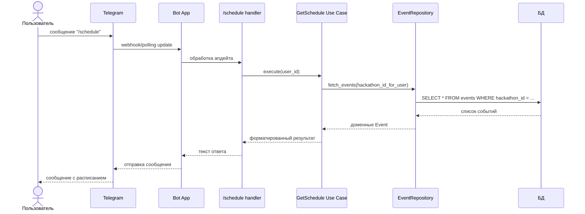
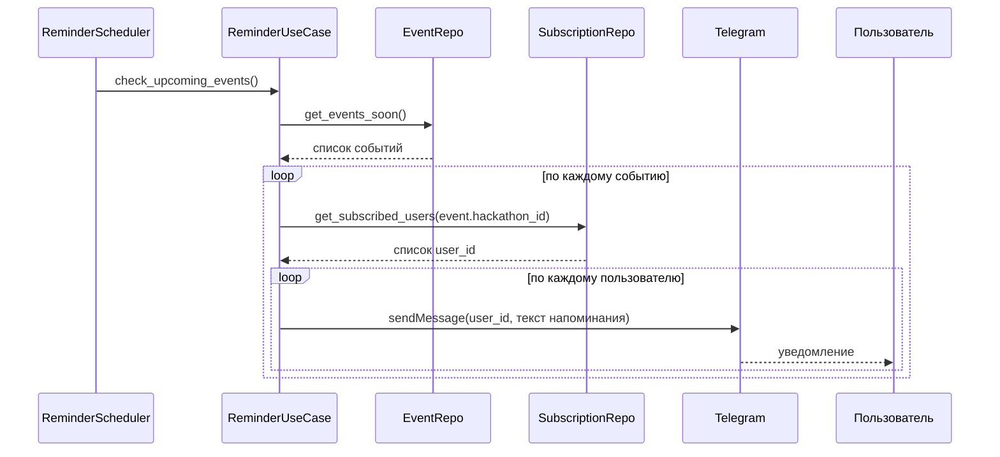
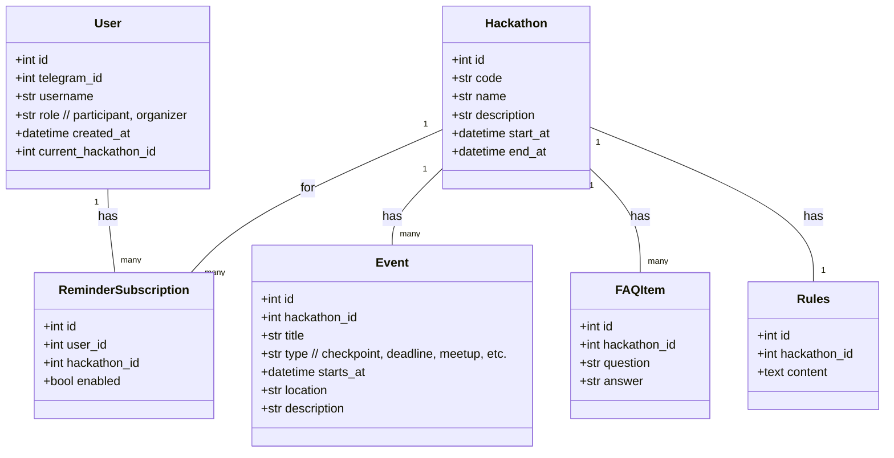
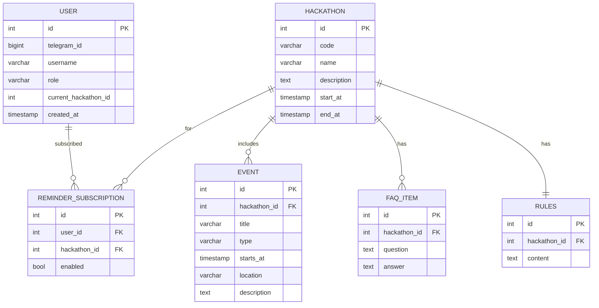

# Телеграм-бот «Хакатон-ассистент»


## 1. Описание продукта

Суть — создание единой точки общения для участников и организаторов. В боте всегда под рукой актуальное расписание, ответы на частые вопросы и оперативные объявления, а также поиск команды и напарников по навыкам. Организаторы могут делать рассылки, запускать быстрые опросы и напоминать о дедлайнах, участники — подписываться на интересующие события и получать уведомления в нужном часовом поясе. Для удобства можно подключить простую веб-панель администратора и, при желании, подтягивать данные из Google Sheets, чтобы не дублировать контент. Цель — снять хаос первых дней, ускорить коммуникацию и сделать участие в хакатоне максимально спокойным и прозрачным.

### 1.1. Проблема

На любом хакатоне повторяется один и тот же набор вопросов:

- когда старт / чекпоинты / дедлайны / защита;
- где посмотреть правила и критерии оценивания;
- где FAQ по организационным вопросам;
- когда и о чём будут напоминания.

Информация оказывается размазанной между:

- Telegram-чатом,
- каналом,
- Google Docs / Sheets.

Это неудобно участникам и создаёт лишнюю нагрузку на организаторов.

### 1.2. Идея и цель

**«Хакатон-ассистент»** — телеграм-бот, который обслуживает **несколько хакатонов одновременно** и:

- хранит расписание событий для каждого хакатона;
- хранит правила и FAQ;
- даёт быстрый доступ к этой информации по командам;
- отправляет напоминания о ближайших событиях (по подписке);
- учитывает роль пользователя (участник / организатор).

**Цель** — сделать бота, который:

- реализован на `aiogram` (async);
- работает через webhook или polling (в Docker-контейнере);
- хранит данные в локальной БД (PostgreSQL/SQLite → к защите PostgreSQL);
- предоставляет удобные сценарии для участника и организатора;
- отправляет напоминания о событиях по расписанию;
- покрыт тестами (coverage ≥ 65%);
- имеет Docker-образ, выложенный на Docker Hub.

---

## 2. Что видит пользователь

Роли:

- **Участник** — читает расписание, правила, FAQ, подключает/отключает напоминания.
- **Организатор** — имеет доступ к административным командам (управление данными, простая статистика).


### 2.1. Сценарии для участника

1. **Первый вход**
   - Пользователь пишет `/start`.
   - Бот:
     - приветствует;
     - предлагает выбрать хакатон (по коду – при первичном входе и из списка – при вторичном);
     - сопоставляет `telegram_id` со списком участников/организаторов и назначает роль;
     - сохраняет `telegram_id`, `username`, `role`, выбранный `hackathon_id`.

2. **Просмотр расписания**
   - Команда `/schedule` или кнопка «Расписание».
   - Бот показывает расписание **текущего хакатона**:
     - ближайшие события с локациями;
     - затем — полное расписание (странично/частями).

3. **Просмотр правил**
   - Команда `/rules` или кнопка «Правила».
   - Бот отправляет текст с основными правилами текущего хакатона:
     - формальные правила;
     - критерии оценивания;
     - требования к сдаче проектов.

4. **Просмотр FAQ**
   - Команда `/faq` или кнопка «FAQ».
   - Бот показывает список типичных вопросов и ответов:
     - регистрация, питание, доступ к инфраструктуре, форматы защиты и т.п.

5. **Напоминания о событиях**
   - `/notify_on` — включить напоминания по выбранному хакатону.
   - `/notify_off` — выключить напоминания.
   - Бот по расписанию (например, за 2 часа и за 15 минут до события) присылает личные сообщения:
     > «Через 2 часа чекпоинт “Промежуточная сдача прототипа”».

6. **Переключение хакатона**
   - Команда `/hackathon` или кнопка «Сменить хакатон».
   - Бот показывает список доступных хакатонов и сохраняет новый выбор.

### 2.2. Сценарии для организатора

Организатор работает либо из того же аккаунта, либо из отдельного орг-аккаунта.

1. `/start` → выбор хакатона → назначение роли «Организатор» (права ограничиваются списком `allowed_admin_ids` в конфиге/БД).
2. `/admin_stats` — короткая статистика:
   - сколько пользователей,
   - сколько по командам и сколько в свободном плавании,
   - сколько подписаны на напоминания,
   - сколько пользователей по каждому хакатону.
3. `/admin_broadcast` — отправка общего уведомления по выбранному хакатону (простой текст, подтверждение отправки).
4. Управление расписанием/FAQ/правилами можно делать через БД/скрипты; если успеем — упрощённый интерфейс типа `/admin_event_add` (необязательная фича, вне минимального объёма).

### 2.3. Создание нового хакатона

Поскольку бот поддерживает несколько хакатонов, важно явно определить, как в систему добавляется новый хакатон и кто за это отвечает.

**Роли:**

- Организатор конкретного хакатона — владеет содержанием (расписание, правила, FAQ).
- Технический администратор / команда, поддерживающая бота — владеет конфигурацией и БД.

**Процесс создания нового хакатона:**

1. Организатор заполняет шаблон с данными хакатона:
   - общая информация (название, код, описание, даты проведения, таймзона);
   - текст правил и критериев оценивания;
   - список FAQ (вопрос–ответ);
   - расписание событий (название, тип, время начала, локация, описание, необходимость напоминаний).

2. Технический администратор переводит эти данные в конфигурационный файл
   (например, `configs/hackathons/hackathon_<code>.yaml`), где фиксируются:
   - основные поля хакатона;
   - перечень правил;
   - перечень FAQ;
   - перечень событий и настройки напоминаний.

3. Запускается служебный CLI-скрипт проекта, который импортирует хакатон в БД:
   - создаёт запись в таблице `Hackathon`;
   - создаёт связанные записи `Rules`, `FAQItem`, `Event`;
   - проверяет валидность дат и обязательных полей.

4. После успешного импорта новый хакатон становится доступен при вводе кода после `/start`.

---

## 3. Задачи проекта

### 3.1. Функциональные задачи

1. Регистрация пользователя и сохранение роли.
2. Выбор и смена текущего хакатона.
3. Хранение расписания событий по каждому хакатону.
4. Хранение правил и общей информации по каждому хакатону.
5. Хранение FAQ (список Q&A) по каждому хакатону.
6. Подписка/отписка на напоминания о событиях.
7. Отправка напоминаний перед событиями (по подписке, асинхронно).
8. Админ-функции:
   - просмотр статистики `/admin_stats`,
   - отправка рассылки `/admin_broadcast`.
9. Проработать сценарий завершения хакатона:
   - что происходит с подписками на уведомления;
   - как пользователю сообщается о завершении хакатона;
   - нужно ли автоматически предлагать выбрать другой хакатон или «выход» из бота;
   - правила хранения/архивации данных хакатона и персональных данных участников.

### 3.2. Нефункциональные задачи и чистая архитектура

- **Domain (домен)** — предметная область. Не зависит ни от бота, ни от БД, ни от инфраструктуры.
- **Use Cases (сценарии)** — прикладная логика, описывающая, «что делает приложение»:
  - показать расписание;
  - показать правила;
  - показать FAQ;
  - подписать/отписать от напоминаний и т.д.
- **Adapters (адаптеры)** — связывают внешние интерфейсы с доменом/сценариями:
  - адаптер Telegram (aiogram-handlers);
  - адаптер БД (репозитории SQLAlchemy, преобразование моделей БД в доменные).
- **Infrastructure (инфраструктура)** — всё, что связано с окружением и запуском:
  - точка входа;
  - настройки, логирование;
  - создание `Bot`, `Dispatcher`, пулов соединений с БД;
  - планировщик фоновых задач;
  - Docker-окружение.

**Ожидаемая структура проекта:**

- `src/hackathon_assistant/domain/` — **Domain**:
  - доменные сущности: `User`, `Hackathon`, `Event`, `FAQItem`, `Rules`, `ReminderSubscription`;
  - простая доменная логика, не зависящая от Telegram, SQLAlchemy и т.п.
- `src/hackathon_assistant/use_cases/` — **Use Cases (сценарии)**:
  - координация доменных операций: `GetSchedule`, `GetRules`, `GetFAQ`, `SubscribeNotifications`, `UnsubscribeNotifications`, `GetAdminStats`, `SendBroadcast`, `SelectHackathon` и т.п.;
  - здесь нет работы напрямую с Telegram/ORM — только вызовы портов/репозиториев.
- `src/hackathon_assistant/adapters/bot/` — **Adapters: Telegram**:
  - aiogram-роутеры и хендлеры;
  - преобразование апдейтов Telegram → входные DTO для use cases;
  - преобразование результатов use cases → тексты/кнопки для Telegram.
- `src/hackathon_assistant/adapters/db/` — **Adapters: БД**:
  - ORM-модели SQLAlchemy;
  - репозитории, реализующие интерфейсы, ожидаемые use cases;
  - маппинг доменных сущностей на таблицы БД.
- `src/hackathon_assistant/infra/` — **Infrastructure**:
  - инициализация приложения (создание бота, диспетчера, подключения к БД);
  - конфигурация (`settings`, работа с `.env`);
  - планировщик фоновых задач (напоминания);
  - точка входа (`main.py`).
- `tests/` — тесты для домена, use cases, адаптеров (юнит + интеграционные).
- `docker/` или `infra/docker/` — Dockerfile, docker-compose и др.

**Направление зависимостей (как в ДЗ-2):**

- `domain` не зависит от адаптеров, инфраструктуры и библиотек ввода/вывода;
- `use_cases` зависятся только от `domain` и абстрактных интерфейсов портов/репозиториев;
- `adapters` знают о `domain` и `use_cases`, но не знают про инфраструктуру запуска;
- `infra` «собирает» всё приложение и вызывает внешние библиотеки (`aiogram`, SQLAlchemy, logging и т.д.).

Дополнительно:

3. Использование **aiogram 3.x**, асинхронный код.  
4. БД: PostgreSQL (для локальной разработки допускается SQLite, но к защите — PostgreSQL).  
5. Асинхронное подключение к БД через SQLAlchemy Async, никакого сырого SQL.  
6. Тесты (pytest) с покрытием ≥ 65 % (юнит-тесты домена и use cases + базовые интеграционные тесты адаптеров).  
7. Паттерны:
   - **Repository** — слой доступа к данным;
   - **Service / Use Case** — слой сценариев;
   - **Factory** — создание объекта бота и конфигурации;
   - при необходимости — **Strategy** для настроек напоминаний.  
8. Переменные окружения в `.env` (добавлен в `.gitignore`):
   - `BOT_TOKEN`,
   - `DATABASE_URL`,
   - другие секреты/настройки.  
9. Docker:
   - Dockerfile для бота;
   - опубликованный образ на Docker Hub;
   - возможность поднять бот одной командой `docker run ...`.

---

## 4. Архитектура и взаимодействия

### 4.1. Слои и зависимости (чистая архитектура)

```mermaid
graph TD
    subgraph Domain
        D[domain/*\n(сущности и доменная логика)]
    end

    subgraph UseCases
        U[use_cases/*\n(сценарии: GetSchedule,\nGetRules, SubscribeNotifications...)]
    end

    subgraph Adapters
        AB[adapters/bot/*\n(aiogram handlers)]
        AD[adapters/db/*\n(ORM-модели,\nрепозитории)]
    end

    subgraph Infra
        I[infra/*\n(main, settings,\ninit app, scheduler)]
    end

    D --> U
    U --> AB
    U --> AD
    AB --> I
    AD --> I
```

### 4.2. Последовательность сценария «Показ расписания»



### 4.3. Последовательность сценария «Напоминание о событии»



## 5. Доменная модель и схема БД

### 5.1. Доменная модель (Mermaid classDiagram)



### 5.2. ER-диаграмма БД (Mermaid erDiagram)



## 6. Команды бота

### 6.1. Основные команды

- `/start` — приветствие, выбор роли, выбор хакатона, регистрация.
- `/help` — краткое описание возможностей бота.
- `/hackathon` — выбор/смена текущего хакатона.
- `/schedule` — расписание текущего хакатона.
- `/rules` — правила текущего хакатона.
- `/faq` — FAQ текущего хакатона.
- `/notify_on` — включить напоминания о событиях.
- `/notify_off` — выключить напоминания.

### 6.2. Команды для организаторов

- `/admin_stats` — статистика по пользователям и подпискам.
- `/admin_broadcast` — отправка объявления участникам выбранного хакатона (простой текст + подтверждение).

**Реализация прав доступа:**

- роли и права хранятся в БД (`User.role`);
- для некоторых команд проверяется как роль, так и `telegram_id` в списке разрешённых админов.

---

## 7. Технологический стек

- Язык: **Python 3.12+**
- Telegram: **aiogram 3.x** (асинхронный фреймворк)
- БД: **PostgreSQL** (к защите), возможно SQLite на раннем этапе разработки
- ORM: **SQLAlchemy Async**
- Миграции: **Alembic**
- Тесты: **pytest**, **coverage** (≥ 65 %)
- Линтеры и форматирование: **ruff / flake8**, **black**, **isort**
- Контейнеризация: **Docker**
- CI (по возможности): **GitHub Actions**

**Секреты:**

- `BOT_TOKEN`, `DATABASE_URL` и др. — в `.env`, который добавлен в `.gitignore`;
- при запуске в Docker — прокидываются как переменные окружения.

---

## 8. План работ и оценка времени

### 8.1. Крупные этапы

| №   | Этап                                                 | Оценка времени (человеко-часы) |
| --- | ---------------------------------------------------- | ------------------------------ |
| 1   | Уточнение сценариев и требуемых ролей                | 2                              |
| 2   | Проектирование архитектуры и доменной модели         | 4                              |
| 3   | Настройка каркаса проекта, конфигурации, aiogram     | 4                              |
| 4   | Реализация моделей БД и репозиториев                 | 7                             |
| 5   | Реализация use cases (schedule, rules, faq, notify)  | 8                             |
| 6   | Реализация Telegram-хендлеров и роутеров (адаптеры)  | 8                             |
| 7   | Реализация сервиса напоминаний и фоновых задач       | 6                              |
| 8   | Тестирование (юнит + базовые интеграционные)         | 9                             |
| 9   | Dockerfile, docker-compose, публикация на Docker Hub | 2                              |
| 10  | Рефакторинг, доведение coverage, мелкие правки       | 6                              |
| 11  | Подготовка к защите (документ, демо-сценарий)        | 3                              |
|     | **Итого**                                            | **≈ 59 ч**                     |

### 8.2. Распределение задач по ролям

**TL**

- проектирование архитектуры, доменной модели и схемы БД;
- настройка структуры проекта, линтеров, базового CI;
- ревью ключевых PR;
- подготовка документа для этапа 4 (описание вкладов участников).

**Dev1 — БД и репозитории**

- реализация ORM-моделей (`User`, `Hackathon`, `Event`, `FAQItem`, `Rules`, `ReminderSubscription`);
- настройка Alembic, миграции;
- реализация репозиториев (адаптеры БД);
- юнит-тесты репозиториев (с тестовой БД).

**Dev2 — Use Cases (сервисный слой)**

- `HackathonService`, `ScheduleService`, `RulesService`, `FAQService`, `ReminderService`;
- логика напоминаний (какие события и когда уведомлять);
- юнит-тесты use cases (mock репозиториев).

**Dev3 — Адаптеры Telegram**

- настройка роутеров aiogram;
- обработка `/start`, `/help`, `/hackathon`, `/schedule`, `/rules`, `/faq`, `/notify_on`, `/notify_off`;
- обработка админ-команд `/admin_stats`, `/admin_broadcast`;
- интеграционные тесты базовых команд.

**Dev4 — Инфраструктура и тесты**

- Dockerfile, docker-compose, публикация образа на Docker Hub;
- дополнительные тесты для повышения coverage;
- документация по запуску (README, `.env.example`);
- подготовка сценария демо для защиты.

